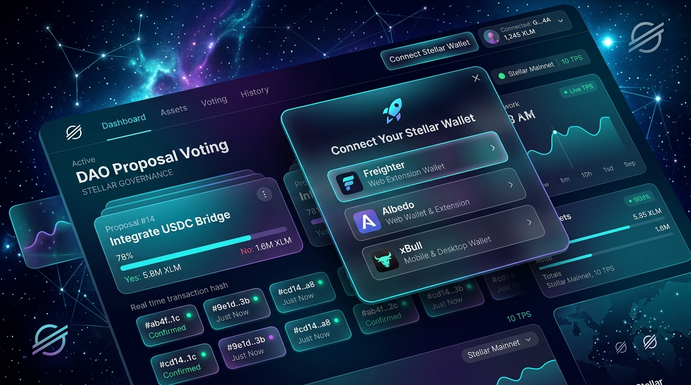

# BallotChain - One-Vote-Per-Wallet Voting Protocol 🗳️


**BallotChain** is a decentralized, one-vote-per-wallet voting protocol powered by **Soroban Smart Contracts** on Stellar Testnet. It uses Freighter to sign real vote and candidate-registration calls, then reads the election state back from the deployed contract.

Created for **Dhananjay Rawat** as part of the **Stellar Journey to Mastery: Monthly Builder Challenges (Level 2 - Yellow Belt Submission)**.

---

## 📸 BallotChain UI Showcase



---

## 📋 Required Submission Details

| Requirement | Value / Link |
| :--- | :--- |
| **Project Name** | **BallotChain** |
| **Developer** | Dhananjay Rawat |
| **Challenge Level** | Level 2 - Yellow Belt Submission |
| **Deployed Contract ID (Soroban Testnet)** | [`CDLZFC3SYJYDZT7K67VZ75HPJVIEUVNQX554EE7ZMBYTXFE6X5W45WLS`](https://stellar.expert/explorer/testnet/contract/CDLZFC3SYJYDZT7K67VZ75HPJVIEUVNQX554EE7ZMBYTXFE6X5W45WLS) |
| **Contract transaction evidence** | Generated only after a submitted transaction is confirmed; the UI links the returned on-chain hash in Stellar Expert. |
| **Wallet signer** | Freighter (`@stellar/freighter-api`) |
| **Smart Contract Architecture** | Rust Soroban Contract (`contracts/live_poll/src/lib.rs`) |
| **Network & Environment** | Stellar Testnet (`https://soroban-testnet.stellar.org`) |

---

## 📦 Complete Dependencies List

### 🌐 Frontend & Wallet Dependencies (`package.json`)
- **`@stellar/freighter-api` (`^2.10.1`)**: Official browser extension API for Freighter wallet connection & transaction signing.
- **`@creit.tech/stellar-wallets-kit` (`^2.5.0`)**: Multi-wallet compatibility wrapper supporting Freighter, Albedo, xBull, Rabet, Lobstr, and Hana.
- **`@stellar/stellar-sdk` (`^16.2.0`)**: Stellar Horizon API and transaction building SDK.
- **`react` & `react-dom` (`^19.0.0`)**: Core React framework for component architecture.
- **`lucide-react` (`^0.479.0`)**: Modern Web3 icon library.
- **`canvas-confetti` (`^1.9.4`)**: Micro-animation library for voting celebration effects.

### 🛠️ Development & Build Tools
- **`vite` (`^6.2.0`)**: Fast dev server and production bundler.
- **`@vitejs/plugin-react` (`^4.3.4`)**: React plugin for Vite.
- **`typescript` (`^5.7.3`)**: Type safety and build compiler.
- **`@types/react`**, **`@types/react-dom`**, **`@types/canvas-confetti`**: TypeScript type declarations.

### 🦀 Rust Soroban Smart Contract Dependencies (`Cargo.toml`)
- **`soroban-sdk` (`20.3.0`)**: Official Soroban Rust SDK for smart contract storage, environment, addresses, data keys, and events.
- **`soroban-sdk` with `testutils` feature (`20.3.0`)**: Soroban contract test environment for unit testing.

### ⚙️ System Requirements
- **Node.js**: `v18.0.0` or higher
- **npm**: `v9.0.0` or higher
- **Rust / Cargo**: `rustc 1.80+` / `cargo 1.80+`

---

## 🔥 BallotChain Features & Level 2 Requirements Checklist

### 1. 🗳️ Candidate Registration & Time-Bound Voting Window
- **Candidate Registration**: Freighter signs a `register_candidate` invocation; the UI refreshes the candidate list from contract storage once it confirms.
- **Time-Bound Voting Window**: Dynamic countdown timer displaying active window start time, end time, and live status.
- **1-Vote-Per-Wallet Enforcement**: Enforces `has_voted(voter)` check on-chain.

### 2. 👛 Wallet Signing (`@stellar/freighter-api`)
- **Freighter Wallet**: Direct browser-extension connection and signing for real Testnet Soroban transactions.

### 3. 🚨 Handled 3 Explicit Error Types
- **`WalletNotInstalledError`**: Extension missing detection & install guidance.
- **`UserRejectedError`**: Transaction signature cancellation handling.
- **`InsufficientBalanceError / NetworkError`**: Low XLM balance handling with interactive **Stellar Friendbot** XLM faucet trigger.

### 4. ⚡ Real-Time Event Sync & Transaction Status Tracker
- **Visual Status Pipeline**: `Idle` ➔ `Wallet Sign` ➔ `Testnet Consensus` ➔ `Confirmed / Failed`.
- **Event Feed**: Shows only transactions confirmed during the current session, with their returned Stellar Explorer links.

---

## 🛠️ Local Setup Instructions

```bash
# 1. Install dependencies
npm install --legacy-peer-deps

# 2. Test Soroban Smart Contract
cd contracts/live_poll
cargo check
cargo test
cd ../..

# 3. Start local development server
npm run dev

# 4. Build production bundle
npm run build
```
